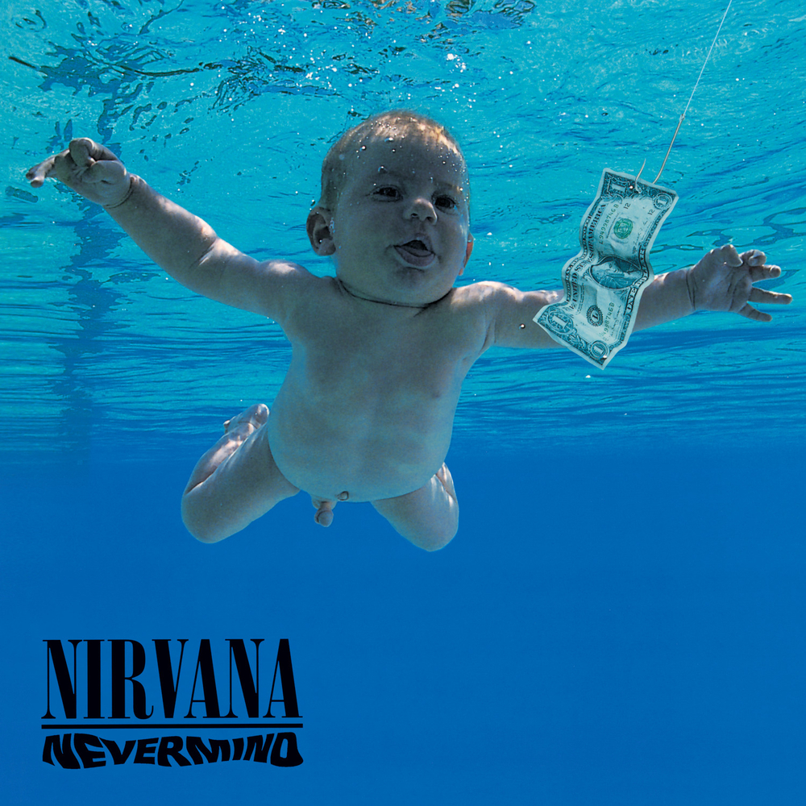
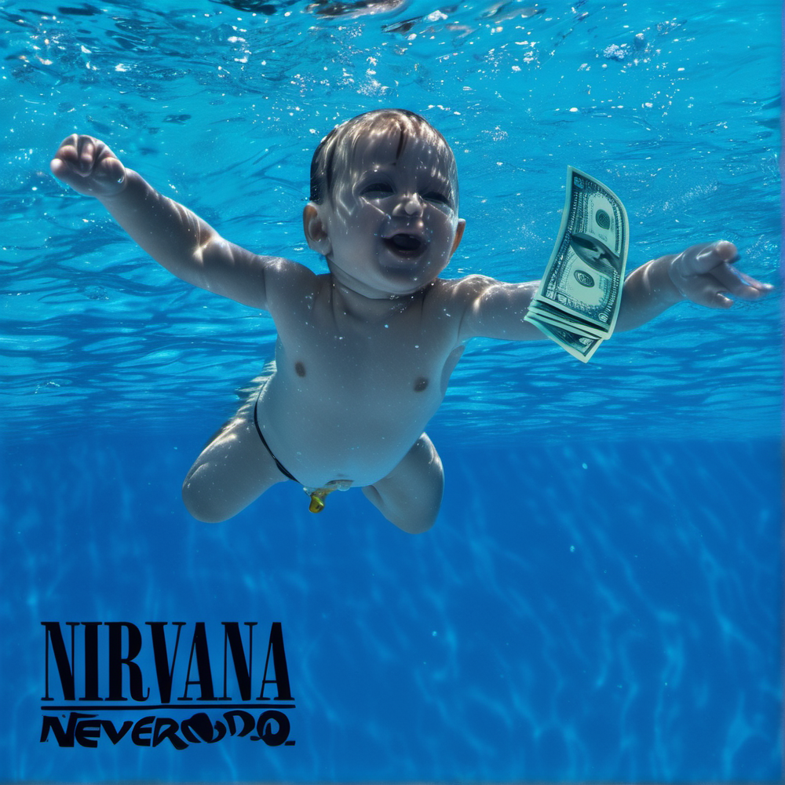
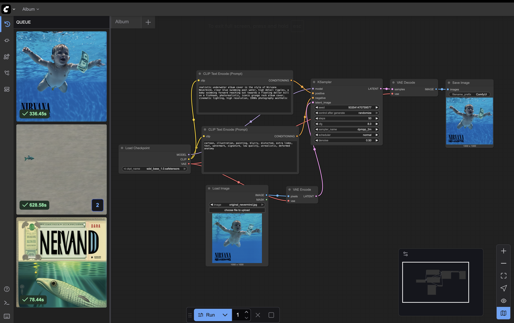

# Art Capstone – Music (Vinyl Album/CD)

### Original Work

---

### AI-Generated Cover

The alternative cover was generated to reinterpret this classic image while keeping its essence: an underwater scene, a baby figure, and the symbolic dollar bill.  
The result preserves the spirit of the original but introduces subtle variations in lighting, style, and form, showing how AI can both honor and reinvent cultural icons.

---

### Workflow

**Model**
- **Model used:** Stable Diffusion XL Base 1.0  
- **File:** `sdxl_base_1.0.safetensors`  
- **Source:** [Stable Diffusion XL Base 1.0 – Hugging Face](https://huggingface.co/stabilityai/stable-diffusion-xl-base-1.0)

**Technical Generation Details**
- **Steps:** 50  
- **CFG Scale:** 8.0  
- **Sampler:** dpmpp_2m_karras  
- **Scheduler:** normal  
- **Resolution:** 1024 × 1024  
- **Seed:** randomized  
- **Batch size:** 2  
- **Denoise strength:** 0.5 (Img2Img with original cover as base)

**Prompt**

*Positive prompt:*  
photorealistic underwater album cover inspired by Nirvana Nevermind, baby swimming forward reaching toward floating dollar bill on a fishhook, clear blue pool water with ripples, cinematic lighting, iconic grunge album cover, highly detailed, realistic photography aesthetic

*Negative prompt:*  
cartoon, illustration, painting, blurry, distorted, text, watermark, deformed anatomy, unrealistic

**Pipeline Screenshot**  

---

### Resources Used
- **Environment:** ComfyUI running locally on macOS  
- **System:** Apple MacBook Pro (M1 chip, 16 GB RAM)  
- **Frameworks:** Python 3.11, ComfyUI v0.3.53  
- **Model Source:** Hugging Face (Stable Diffusion XL Base 1.0)  
- **Output directory:** `~/ComfyUI/output/`

---

### Media Option
- Chosen type: **Vinyl/CD Album Cover**  
- Original: *Nirvana – Nevermind (1991)*  
- Generated: Alternative underwater reinterpretation of *Nevermind* cover with Stable Diffusion XL  
