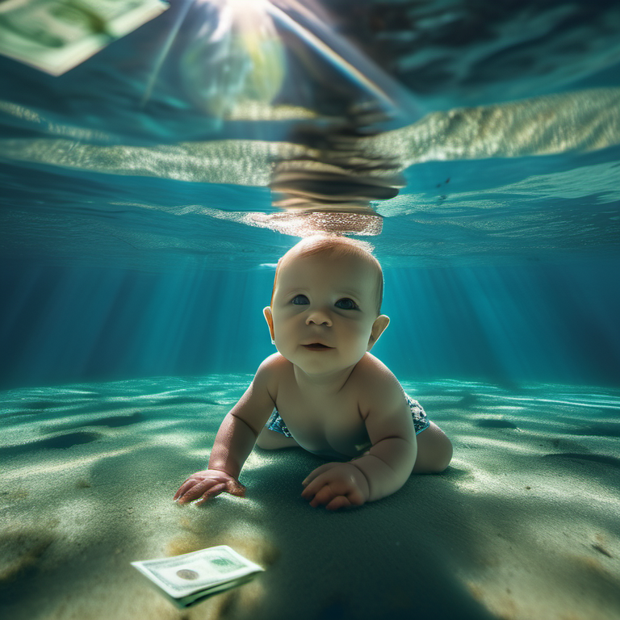
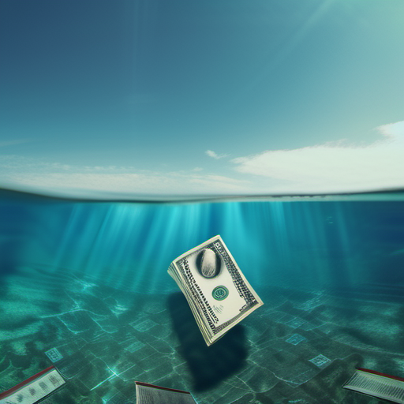

# Art Capstone – Music (Vinyl Album/CD)

### Original Work

| Pipeline Screenshot | AI-Generated Cover |
|---------------------|--------------------|
|  |  |
| **Positive prompt:** photorealistic underwater album cover inspired by Nirvana Nevermind, baby swimming forward reaching toward floating dollar bill on a fishhook, clear blue pool water with ripples, cinematic lighting, iconic grunge album cover, highly detailed, realistic photography aesthetic    **Negative prompt:** cartoon, illustration, painting, blurry, distorted, text, watermark, deformed anatomy, unrealistic | **Workflow:** Steps: 50 • CFG: 8.0 • Sampler: dpmpp_2m • Scheduler: normal • Resolution: 1024×1024 • Seed: randomized • Batch size: 2 • Denoise: 0.5 (Img2Img with original cover as base) |

| Pipeline Screenshot | AI-Generated Cover |
|---------------------|--------------------|
|  |  |
| **Positive prompt:** cinematic underwater scene, surreal album cover design, floating baby boy, floating small dollar bill, crystal clear blue water, sunlight rays from surface, dramatic lighting, high detail, photorealistic yet artistic, sharp focus    **Negative prompt:** cartoon, illustration, painting, blurry, distorted, text, watermark, deformed anatomy, unrealistic | **Workflow:** Steps: 25 • CFG: 6.0 • Sampler: dpmpp_2m • Scheduler: karras • Seed: 573527104548294 (randomized) • Denoise: 1.0 • Resolution: 768×768 • Checkpoint: `sdxl_base_1.0.safetensors` |

| Pipeline Screenshot | AI-Generated Cover |
|---------------------|--------------------|
|  |  |
| **Positive prompt:** photorealistic underwater album cover, baby swimming, floating dollar bill, clear blue pool water, cinematic lighting, iconic grunge album cover, highly detailed, realistic photography aesthetic    **Negative prompt:** cartoon, illustration, painting, blurry, distorted, text, watermark, deformed anatomy, unrealistic | **Workflow:** Steps: 25 • CFG: 6.0 • Sampler: dpmpp_2m • Scheduler: karras • Seed: 425698918098466 (fixed) • Denoise: 1.0 • Resolution: 512×512 • **LoRA:** [UNDERWATER_SCENE_v2](https://civitai.com/models/173332/cinematicpaintingxl) (strength: 0.60) • Checkpoint: `sdxl_base_1.0.safetensors` |

### Model

- **Model used:** Stable Diffusion XL Base 1.0  
- **File:** `sdxl_base_1.0.safetensors`  
- **Source:** [Stable Diffusion XL Base 1.0 – Hugging Face](https://huggingface.co/stabilityai/stable-diffusion-xl-base-1.0)

### Media Option
- Chosen type: **Vinyl/CD Album Cover**  
- Original: *Nirvana – Nevermind (1991)*  
- Generated: Alternative underwater reinterpretation of *Nevermind* cover with Stable Diffusion XL  
