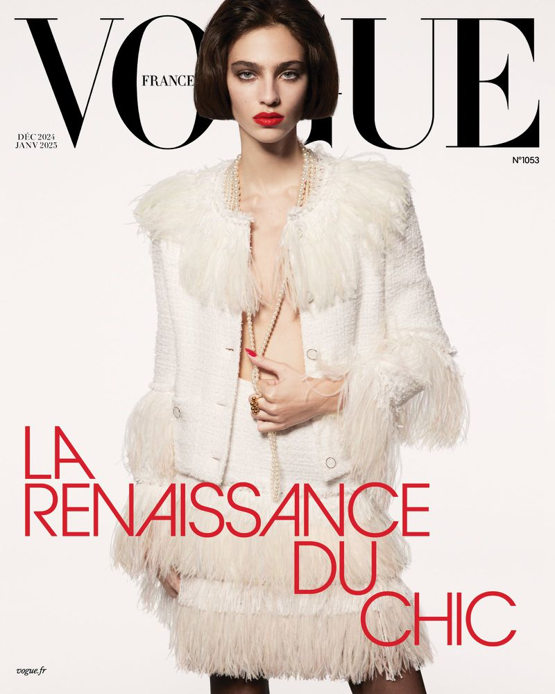
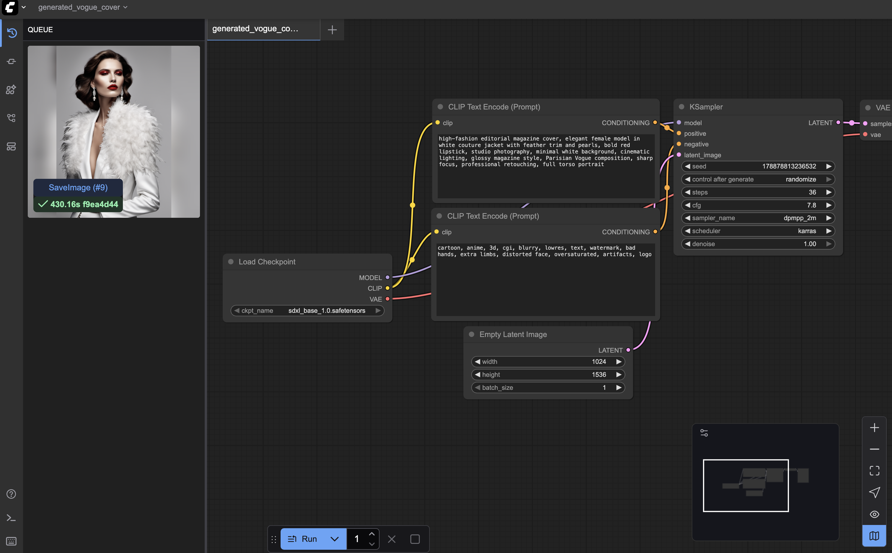
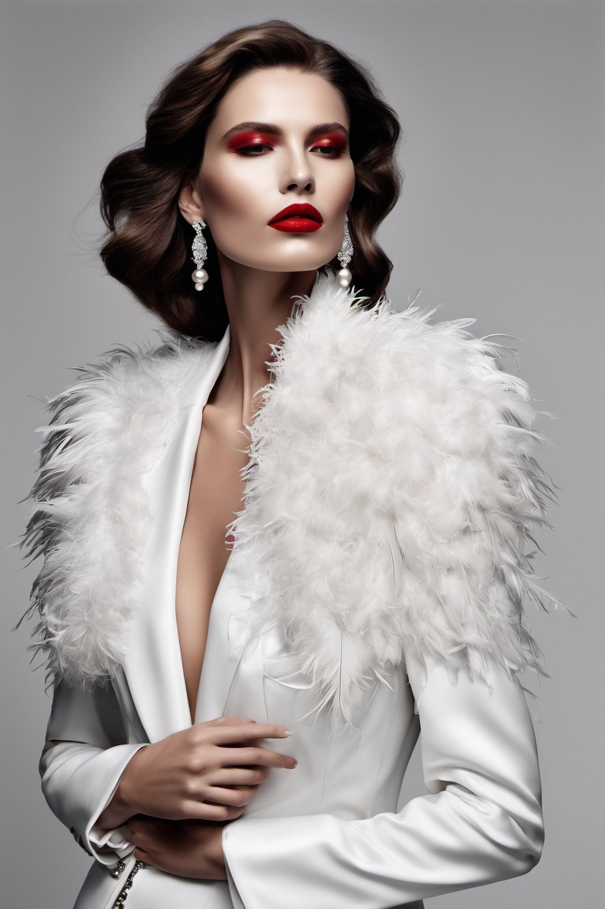
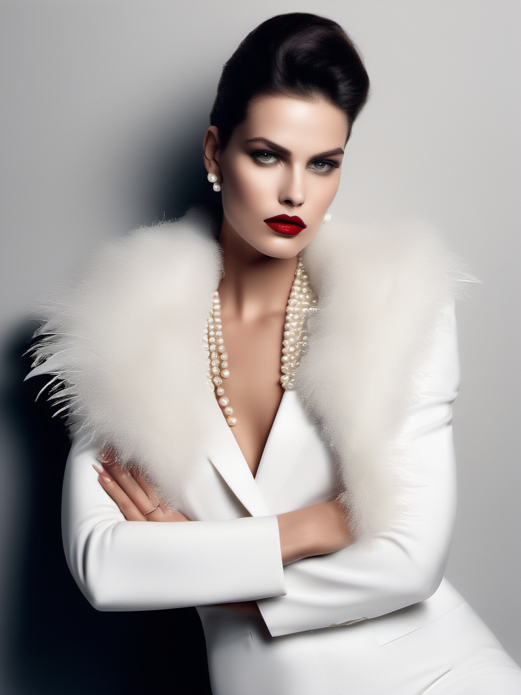

# Art Capstone – Alternative Media Cover

## Objective
Design a new cover for an iconic media piece.  
The goal is to create an alternative variation of an existing cover using a **self-hosted AI image generation workflow** (ComfyUI with Stable Diffusion XL).  
No cloud-hosted or external services (like Sora/Replicate) were used — only a locally run pipeline.

## Original Work

| Pipeline Screenshot | AI-Generated Cover |
|---------------------|--------------------|
|  |  |
| **Positive prompt:** high-fashion editorial magazine cover, elegant female model in white couture jacket with feather trim and pearls, bold red lipstick, studio photography, minimal white background, cinematic lighting, glossy magazine style, Parisian Vogue composition, sharp focus, professional retouching, full torso portrait    **Negative prompt:** cartoon, anime, 3d, cgi, blurry, lowres, text, watermark, bad hands, extra limbs, distorted face, oversaturated, artifacts, logo | **Workflow:** Steps: 36 • CFG: 7.8 • Sampler: dpmpp_2m • Scheduler: karras • Resolution: 1024×1536 • Seed: randomized • Batch size: 1 • **Model:** [Stable Diffusion XL Base 1.0](https://huggingface.co/stabilityai/stable-diffusion-xl-base-1.0) (`sdxl_base_1.0.safetensors`) |

| Pipeline Screenshot | AI-Generated Cover |
|---------------------|--------------------|
|  |  |
| **Positive prompt:** high-fashion editorial magazine cover, elegant female model in white couture jacket with feather trim and pearls, bold red lipstick, studio photography, minimal white background, cinematic lighting, glossy magazine style, Parisian Vogue composition, sharp focus, professional retouching, full torso portrait, mid-thigh crop, centered composition, fashion magazine cover framing    **Negative prompt:** cartoon, anime, 3d, cgi, blurry, lowres, text, watermark, bad hands, extra limbs, distorted face, oversaturated, artifacts, logo | **Workflow:** Steps: 25 • CFG: 7.8 • Sampler: ddpm • Scheduler: karras • Seed: 947247178758453 (randomized) • Denoise: 1.0 • Resolution: 768×1024 • **Model:** [Stable Diffusion XL Base 1.0](https://huggingface.co/stabilityai/stable-diffusion-xl-base-1.0) (`sdxl_base_1.0.safetensors`) • **LoRA:** [GRM80-analogphotosv2.3](https://civitai.com/) (strength: 0.90 / 0.80) |

## Model
- **Model used:** Stable Diffusion XL Base 1.0  
- **File:** `sdxl_base_1.0.safetensors`  
- **Source:** [Stable Diffusion XL Base 1.0 – Hugging Face](https://huggingface.co/stabilityai/stable-diffusion-xl-base-1.0)

## Media Option
- Chosen type: **Magazine Cover**  
- Original: *Vogue France, December 2024 / January 2025*  
- Generated: Alternative Vogue-style cover with Stable Diffusion XL
