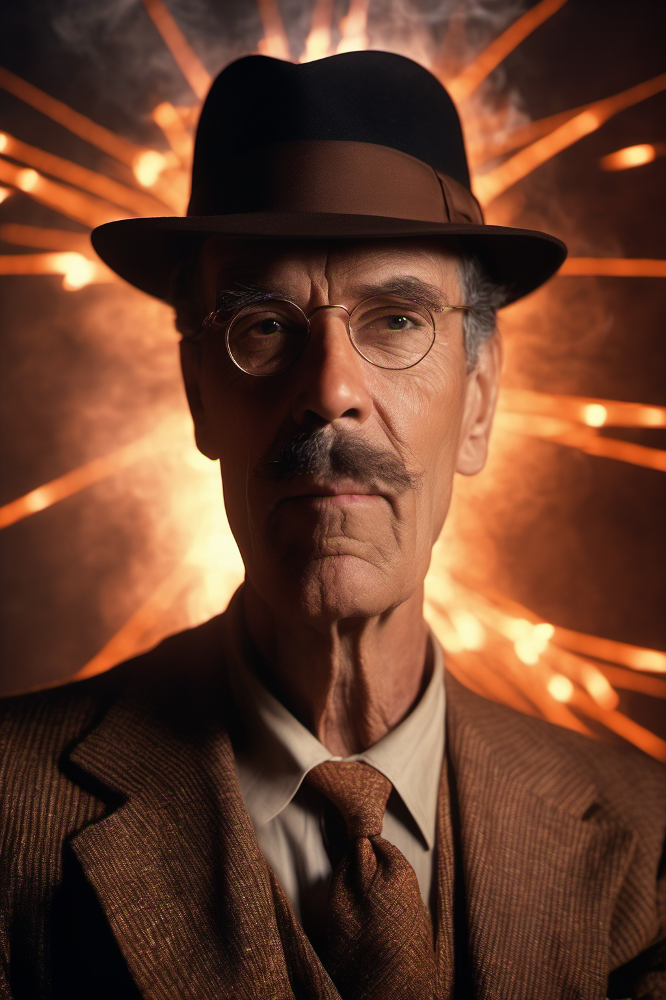
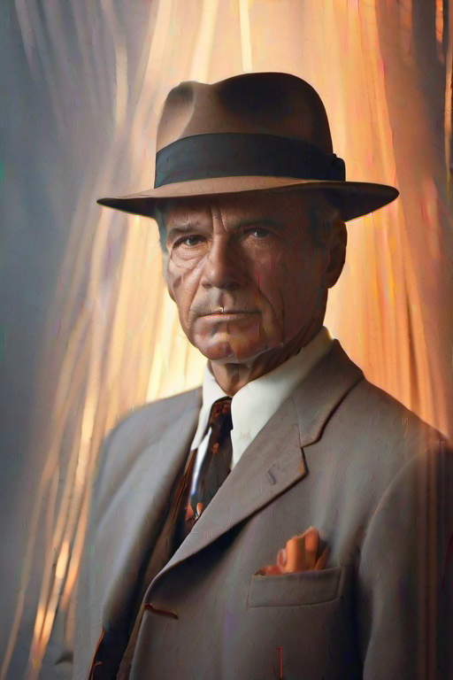

# Art Capstone – Movie

### Original Work

| Pipeline Screenshot | AI-Generated Cover |
|---------------------|--------------------|
|  |  |
| **Positive prompt:** dramatic DVD movie cover inspired by Oppenheimer, intense cinematic atmosphere, man in classic 1940s suit and fedora, glowing fire and atomic energy in background, surreal yet realistic, high detail, sharp photography, epic historical drama  **Negative prompt:** cartoon, anime, illustration, painting, blurry, low quality, text, watermark, distorted face, unrealistic anatomy| **Workflow:** Steps: 41 • CFG: 7.5 • Sampler: dpmpp_2m • Seed: random • Denoise: 0.6 |

| Pipeline Screenshot | AI-Generated Cover |
|---------------------|--------------------|
|   | |
| **Positive prompt:** dramatic portrait of a 1940s physicist wearing a fedora and classic suit, intense expression, centered composition, waist-up, cinematic, volumetric rim light, glowing orange embers, copper wires and lab instruments softly out of focus, photorealistic, high detail, 85mm lens, film grain    **Negative prompt:** cartoon, lowres, blurry, extra limbs, watermark, logo, text, distorted face, bad hands | **Workflow:** Steps: 50 • CFG: 6.0 • Sampler: dpmpp_3m_sde • Scheduler: karras • Seed: 156680208700286 • Denoise: 0.95 • Resolution: 1024×1536 |

| Pipeline Screenshot | AI-Generated Cover |
|---------------------|--------------------|
|  |  |
| **Positive prompt:** dramatic portrait of a 1940s physicist wearing a fedora and classic suit, waist-up, cinematic volumetric rim light, glowing orange embers, copper wires in background, photorealistic, cinematic painting style, film grain    **Negative prompt:** cartoon, lowres, blurry, extra limbs, watermark, logo, text, distorted face, bad hands | **Workflow:** Steps: 20 • CFG: 8.0 • Sampler: dpmpp_2m • Scheduler: normal • Seed: 59770402897080 (randomized) • Denoise: 0.95 • Resolution: 512×768 • **LoRA:** [Cinematic_Painting_XL_V02](https://civitai.com/models/173332/cinematicpaintingxl) (strength: 0.60) |

**Model**
- **Model used:** Stable Diffusion XL Base 1.0  
- **File:** `sdxl_base_1.0.safetensors`  
- **Source:** [Stable Diffusion XL Base 1.0 – Hugging Face](https://huggingface.co/stabilityai/stable-diffusion-xl-base-1.0)

### Media Option
- Chosen type: **DVD/VHS Movie Cover**  
- Original: *Oppenheimer (2023)*  
- Generated: Alternative reinterpretation of *Oppenheimer* cover with Stable Diffusion XL  

