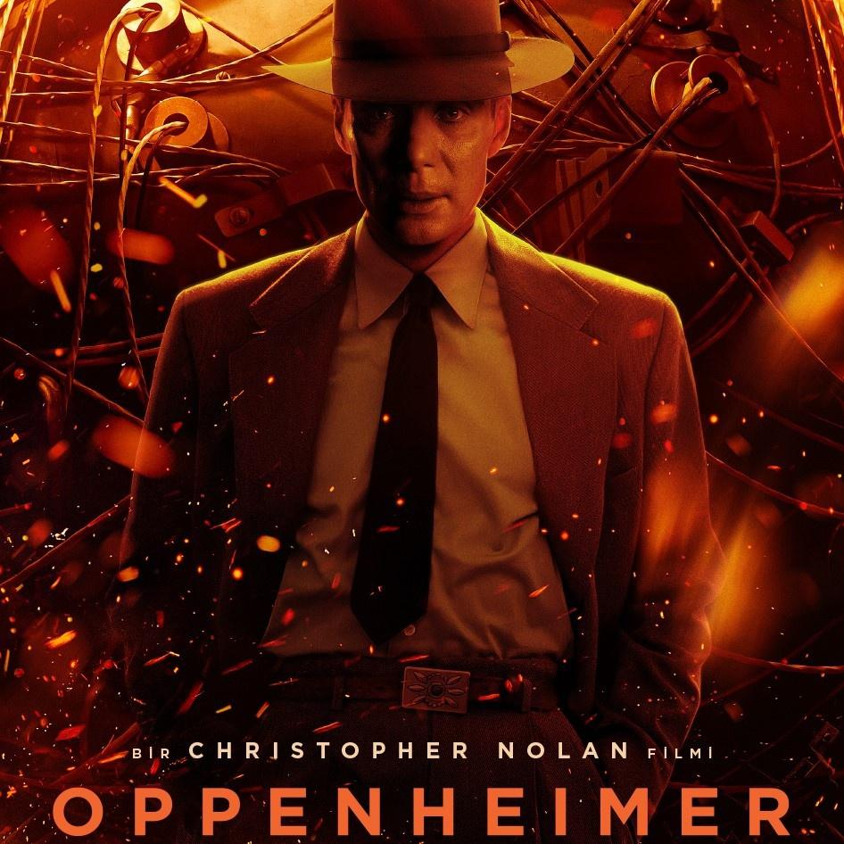
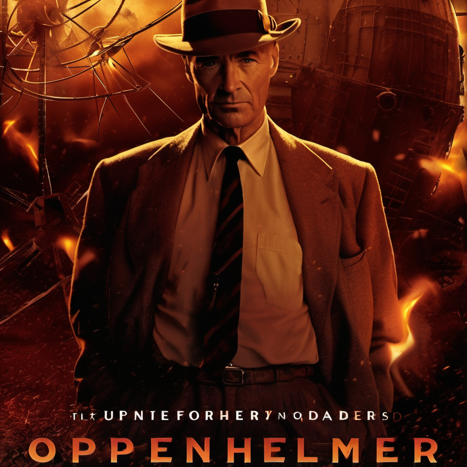
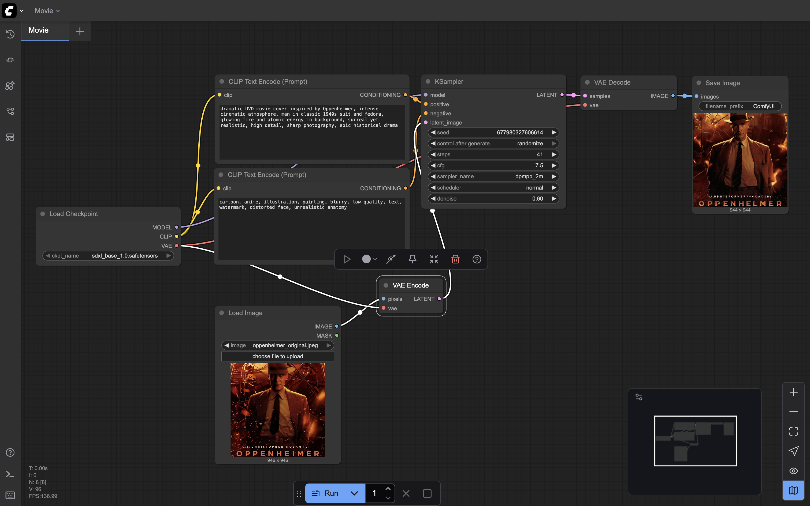

# Art Capstone – Movie

### Original Work

### AI-Generated Cover

---

### Workflow

**Model**
- **Model used:** Stable Diffusion XL Base 1.0  
- **File:** `sdxl_base_1.0.safetensors`  
- **Source:** [Stable Diffusion XL Base 1.0 – Hugging Face](https://huggingface.co/stabilityai/stable-diffusion-xl-base-1.0)

**Technical Generation Details**
- **Steps:** 41  
- **CFG Scale:** 7.5  
- **Sampler:** dpmpp_2m  
- **Scheduler:** normal  
- **Seed:** randomized  
- **Batch size:** 1  
- **Denoise strength:** 0.6 (Img2Img with original poster as base)

**Prompt**

*Positive prompt:*  
dramatic DVD movie cover inspired by Oppenheimer, intense cinematic atmosphere, man in classic 1940s suit and fedora, glowing fire and atomic energy in background, surreal yet realistic, high detail, sharp photography, epic historical drama

*Negative prompt:*  
cartoon, anime, illustration, painting, blurry, low quality, text, watermark, distorted face, unrealistic anatomy

**Pipeline Screenshot**  

---

### Resources Used
- **Environment:** ComfyUI running locally on macOS  
- **System:** Apple MacBook Pro (M1 chip, 16 GB RAM)  
- **Frameworks:** Python 3.11, ComfyUI v0.3.53  
- **Model Source:** Hugging Face (Stable Diffusion XL Base 1.0)  
- **Output directory:** `~/ComfyUI/output/`

---

### Media Option
- Chosen type: **DVD/VHS Movie Cover**  
- Original: *Oppenheimer (2023)*  
- Generated: Alternative reinterpretation of *Oppenheimer* cover with Stable Diffusion XL  

