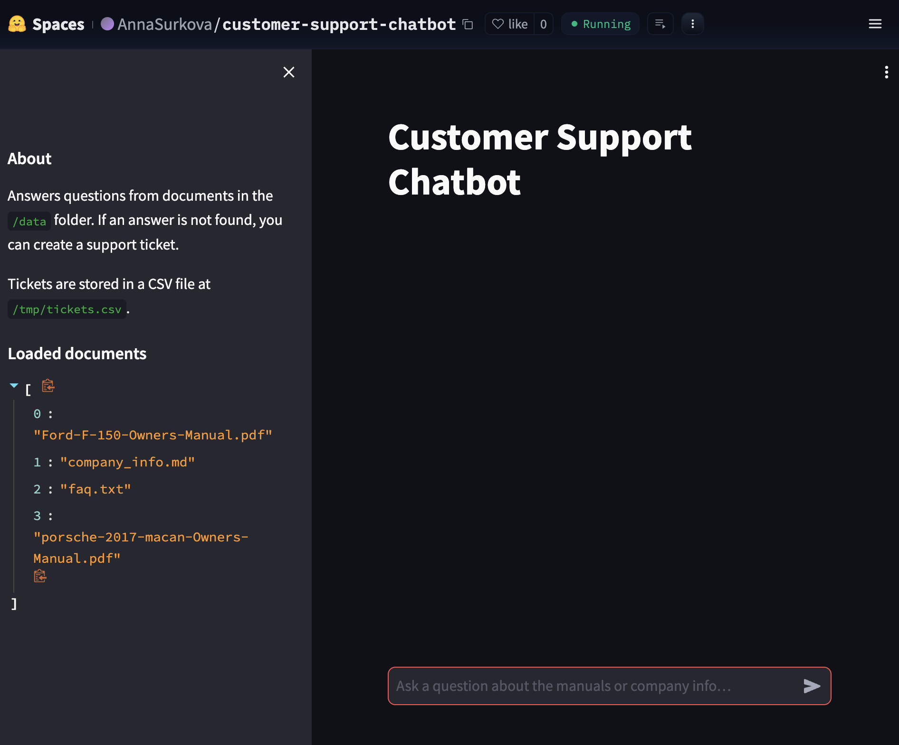

# Customer Support Chatbot



## Project Overview
This project implements a **Customer Support Chatbot** that can answer questions from company documents and car manuals, and if no answer is found, it allows the user to create a **support ticket**.  
The system runs **fully self-hosted** on Hugging Face Spaces using **Streamlit** and Python.  

The chatbot:
- Answers questions directly from PDF manuals and company documents.  
- Cites the **document name and page number** when an answer is found.  
- If no answer is found, suggests creating a **support ticket** (saved into a CSV or integrated into issue trackers).  
- Keeps **conversation history** during the session.  
- Knows about the company (name, contact info).  

---

## Tools and Technologies
- **Language:** Python 3.11  
- **Framework:** Streamlit (web UI)  
- **Deployment:** Hugging Face Spaces (CPU free tier)  
- **Libraries:**  
  - PyPDF2 (PDF parsing)  
  - Pandas (ticket logging, CSV export)  
  - Streamlit (UI and chatbot logic)  

---

## Data Sources
At least 3 documents are used as required:
1. `Ford-F-150-Owners-Manual.pdf` (400+ pages ✅)  
2. `porsche-2017-macan-Owners-Manual.pdf` (PDF ✅)  
3. `company_info.md` (company background & contacts)  
4. `faq.txt` (optional Q&A dataset)  

---

## Requirements Verification

✔ **Business Features**  
- User can ask questions via web chat.  
- Answers come from local documents (PDFs, markdown, text).  
- If no answer is found, the system suggests creating a **support ticket**.  
- Support tickets include: user name, email, summary, description.  
- Tickets stored locally (`tickets.csv`) — can be extended to Jira/Trello/GitHub Issues.  
- System cites **document + page** when answering.  
- Conversation history is supported.  
- Company info is integrated (`company_info.md`).  

✔ **Data Requirements**  
- At least 3 data sources.  
- At least 2 PDFs.  
- One PDF has 400+ pages (Ford manual).  

✔ **Technical Requirements**  
- Built with Python.  
- Requirements listed in `requirements.txt`.  
- Runs with vector-like search over documents (string matching / can be extended to FAISS).  
- Interface built in **Streamlit**.  
- Hosted on **Hugging Face Spaces**.  

---

## How to Run Locally
```bash
git clone https://github.com/<your-username>/customer-support-chatbot.git
cd customer-support-chatbot
pip install -r requirements.txt
streamlit run app.py
